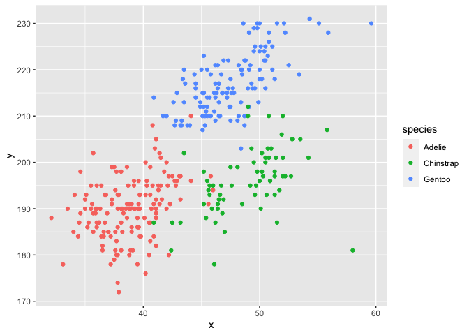

Homework 1
================
Minjie Bao

This is my solution to HW1.

``` r
library(tidyverse)
```

    ## ── Attaching packages ───────────────────────────────────────── tidyverse 1.3.0 ──

    ## ✓ ggplot2 3.3.2     ✓ purrr   0.3.4
    ## ✓ tibble  3.0.3     ✓ dplyr   1.0.2
    ## ✓ tidyr   1.1.2     ✓ stringr 1.4.0
    ## ✓ readr   1.3.1     ✓ forcats 0.5.0

    ## ── Conflicts ──────────────────────────────────────────── tidyverse_conflicts() ──
    ## x dplyr::filter() masks stats::filter()
    ## x dplyr::lag()    masks stats::lag()

## Problem 1

#### Create a data frame from with the specified elements.

``` r
prob1_df =
  tibble(
    samp = rnorm(10),
    samp_gt_0 = samp>0,
    char_vec = c("a","b","c","d","e","f","g","h","i","j"),
    factor_vec = factor(c("low","low","low","mod","mod","mod","mod","high","high","high"))
)
```

#### Take the mean of each variable in my data frame.

``` r
mean(pull(prob1_df, samp))
```

    ## [1] 0.1674321

``` r
mean(pull(prob1_df, samp_gt_0))
```

    ## [1] 0.4

``` r
mean(pull(prob1_df, char_vec))
```

    ## Warning in mean.default(pull(prob1_df, char_vec)): argument is not numeric or
    ## logical: returning NA

    ## [1] NA

``` r
mean(pull(prob1_df, factor_vec))
```

    ## Warning in mean.default(pull(prob1_df, factor_vec)): argument is not numeric or
    ## logical: returning NA

    ## [1] NA

I can take the mean of numbers and logical but not character or factor.

``` r
as.numeric(pull(prob1_df, samp))
```

    ##  [1] -0.46498269 -0.21151972  0.81505746 -0.34266782  0.86822291 -0.09094415
    ##  [7] -0.88110704 -0.33577689  1.59517448  0.72286450

``` r
as.numeric(pull(prob1_df, samp_gt_0))
```

    ##  [1] 0 0 1 0 1 0 0 0 1 1

``` r
as.numeric(pull(prob1_df, char_vec))
```

    ## Warning: NAs introduced by coercion

    ##  [1] NA NA NA NA NA NA NA NA NA NA

``` r
as.numeric(pull(prob1_df, factor_vec))
```

    ##  [1] 2 2 2 3 3 3 3 1 1 1

#### convert the logical vector to different data types and multiply the random sample by the result

``` r
as.numeric(pull(prob1_df, samp_gt_0)) * pull(prob1_df, samp)
```

    ##  [1] 0.0000000 0.0000000 0.8150575 0.0000000 0.8682229 0.0000000 0.0000000
    ##  [8] 0.0000000 1.5951745 0.7228645

``` r
as.factor(pull(prob1_df, samp_gt_0)) * pull(prob1_df, samp)
```

    ## Warning in Ops.factor(as.factor(pull(prob1_df, samp_gt_0)), pull(prob1_df, : '*'
    ## not meaningful for factors

    ##  [1] NA NA NA NA NA NA NA NA NA NA

``` r
as.numeric(as.factor(pull(prob1_df, samp_gt_0))) * pull(prob1_df, samp)
```

    ##  [1] -0.46498269 -0.21151972  1.63011493 -0.34266782  1.73644583 -0.09094415
    ##  [7] -0.88110704 -0.33577689  3.19034896  1.44572899

## Problem 2

#### load penguins dataset.

``` r
data("penguins", package = "palmerpenguins")
penguins
```

    ## # A tibble: 344 x 8
    ##    species island bill_length_mm bill_depth_mm flipper_length_… body_mass_g
    ##    <fct>   <fct>           <dbl>         <dbl>            <int>       <int>
    ##  1 Adelie  Torge…           39.1          18.7              181        3750
    ##  2 Adelie  Torge…           39.5          17.4              186        3800
    ##  3 Adelie  Torge…           40.3          18                195        3250
    ##  4 Adelie  Torge…           NA            NA                 NA          NA
    ##  5 Adelie  Torge…           36.7          19.3              193        3450
    ##  6 Adelie  Torge…           39.3          20.6              190        3650
    ##  7 Adelie  Torge…           38.9          17.8              181        3625
    ##  8 Adelie  Torge…           39.2          19.6              195        4675
    ##  9 Adelie  Torge…           34.1          18.1              193        3475
    ## 10 Adelie  Torge…           42            20.2              190        4250
    ## # … with 334 more rows, and 2 more variables: sex <fct>, year <int>

#### part1 : the data in this dataset (names / values of important variables), the size of the dataset, the mean flipper length

``` r
ls(penguins)
```

    ## [1] "bill_depth_mm"     "bill_length_mm"    "body_mass_g"      
    ## [4] "flipper_length_mm" "island"            "sex"              
    ## [7] "species"           "year"

``` r
summary(penguins)
```

    ##       species          island    bill_length_mm  bill_depth_mm  
    ##  Adelie   :152   Biscoe   :168   Min.   :32.10   Min.   :13.10  
    ##  Chinstrap: 68   Dream    :124   1st Qu.:39.23   1st Qu.:15.60  
    ##  Gentoo   :124   Torgersen: 52   Median :44.45   Median :17.30  
    ##                                  Mean   :43.92   Mean   :17.15  
    ##                                  3rd Qu.:48.50   3rd Qu.:18.70  
    ##                                  Max.   :59.60   Max.   :21.50  
    ##                                  NA's   :2       NA's   :2      
    ##  flipper_length_mm  body_mass_g       sex           year     
    ##  Min.   :172.0     Min.   :2700   female:165   Min.   :2007  
    ##  1st Qu.:190.0     1st Qu.:3550   male  :168   1st Qu.:2007  
    ##  Median :197.0     Median :4050   NA's  : 11   Median :2008  
    ##  Mean   :200.9     Mean   :4202                Mean   :2008  
    ##  3rd Qu.:213.0     3rd Qu.:4750                3rd Qu.:2009  
    ##  Max.   :231.0     Max.   :6300                Max.   :2009  
    ##  NA's   :2         NA's   :2

``` r
nrow(penguins)
```

    ## [1] 344

``` r
ncol(penguins)
```

    ## [1] 8

``` r
size = nrow(penguins) * ncol(penguins)
print(size)
```

    ## [1] 2752

``` r
mean(penguins$flipper_length_mm, na.rm = TRUE)
```

    ## [1] 200.9152

Explanation of the codes:

From ls(penguins), we can see that there are 8 variables:
“bill\_depth\_mm”, “bill\_length\_mm”, “body\_mass\_g”,
“flipper\_length\_mm” “island”, “sex”, “species”, “year”.

From summary (penguins), we can see the 5 number summary and mean of
each variable.

The dataset has 344 rows and 8 columns. The size of the dataset is 2752.

The mean of flipper length is 200.9152.

#### part 2 : scatterplot and ggsave

``` r
plot_df = tibble(x = pull(penguins,bill_length_mm), y = pull(penguins,flipper_length_mm), species=pull(penguins,species))
view(plot_df)
ggplot(plot_df, aes(x = x, y = y, color=species)) + geom_point()
```

    ## Warning: Removed 2 rows containing missing values (geom_point).

<!-- -->

``` r
ggsave("scatter_plot.pdf", height = 4, width = 6)
```

    ## Warning: Removed 2 rows containing missing values (geom_point).

HW1 finished.
